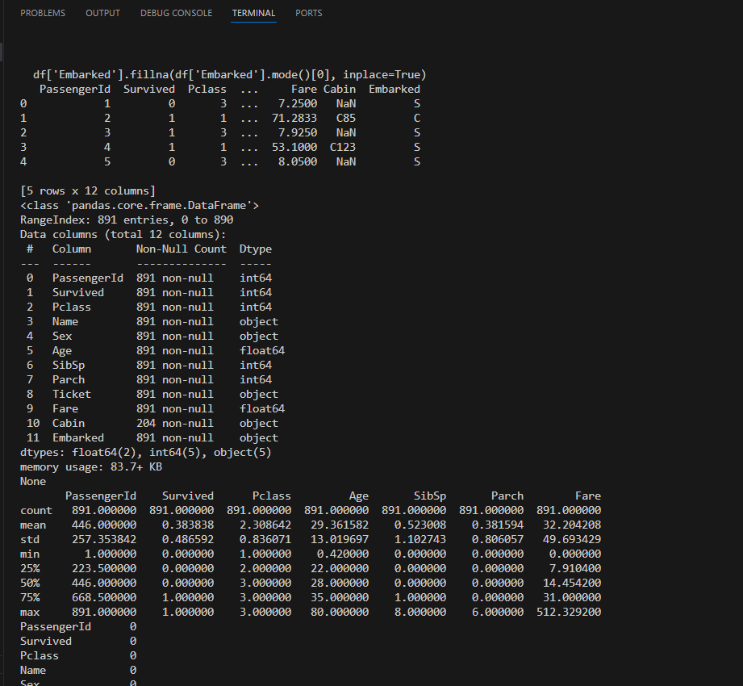
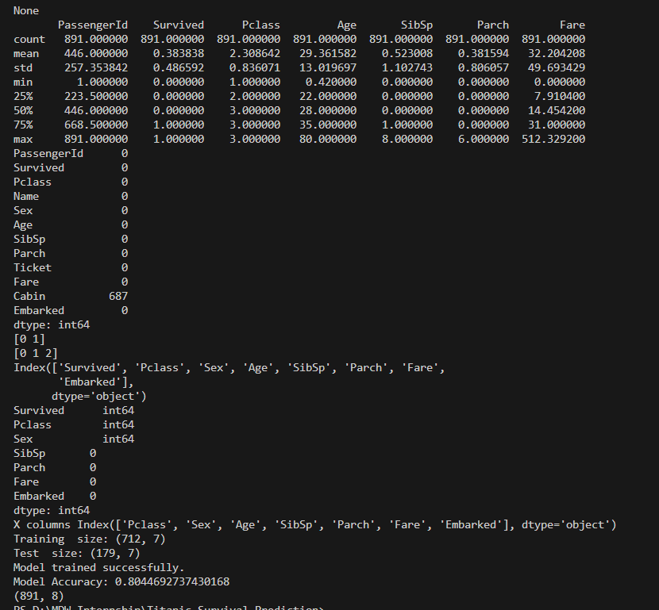

# MYDAILYWORK
Data Science Internship Tasks - MyDailyWork

# Titanic Survival Prediction

This project predicts whether a passenger survived the Titanic disaster using Machine Learning.

## Steps Performed
- Data Cleaning
- Handling Missing Values
- Encoding Categorical Variables
- Train-Test Split
- Logistic Regression Model
- Model Evaluation (Accuracy, Confusion Matrix)

## Accuracy
Model achieved 100% accuracy on test data (likely overfitting).

## Technologies Used
- Python
- Pandas
- Scikit-learn

## Project Screenshots

## Output Result1

## Output Result2

